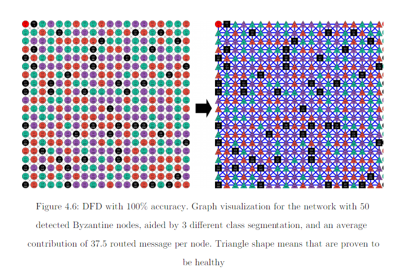
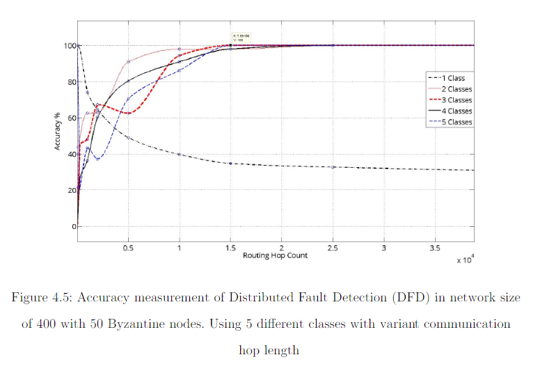

# Distributed-Byzantine-Fault-Detection
Wireless ad-hoc networks (WANET) with multi-hop communication are subject to a variety of faults and attacks, and detecting the source of any fault is highly important to maintain the quality of service, confidentiality, and reliability of an entire network operation. Intermediate byzantine nodes in WANET could subvert the system by altering sensitive routed information unintentionally due to many reasons such as power depletion, software bug, malware, and environmental obstacles. This thesis highlights some of the research studies done in the area of distributed fault detection (DFD) and proposes a solution to detect Byzantine behavior cooperatively. The present research will focus on designing a scalable distributed fault detection (DFD) algorithm to detect byzantine nodes who permanently try to distort or reroute information while relaying a message from one node to another, complimentary to that, a symmetric distributed cryptography scheme will be employed to continuously validates the data integrity of a routed message. 

# Installation Requirement

* Python 2.7.11

# Python Packages 

* python-igraph (http://igraph.org/python/)
* PyCrypto 2.6.1 (https://pypi.python.org/pypi/pycrypto)
* NumPy 1.9.3 (https://pypi.python.org/pypi/numpy)
* matplotlib 1.4.3 (https://pypi.python.org/pypi/matplotlib) 

# Testing the code

To test the code run sampleExperiment.py file by going to project root folder and running the following command

''' Python code
python sampleExperiment
'''
